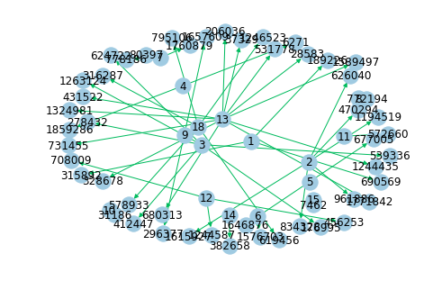
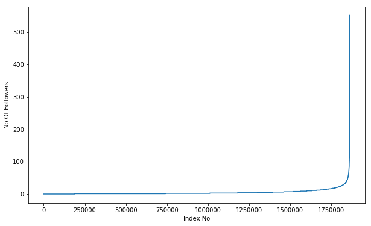
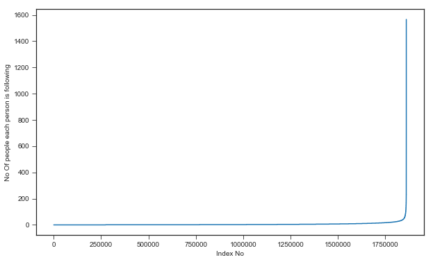
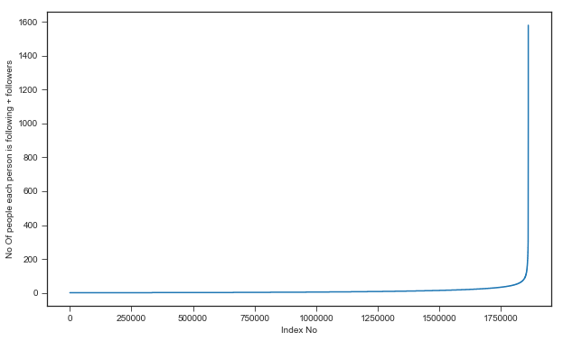
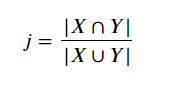
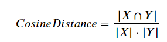
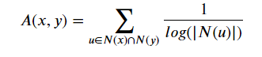
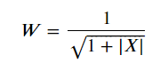
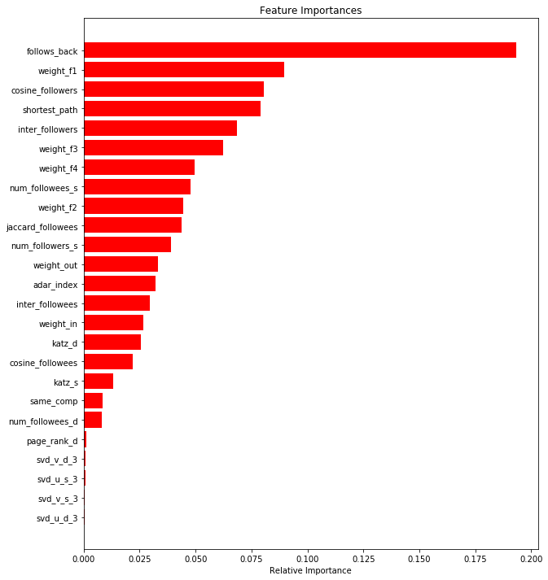

# Social Network Link Prediction Problem: Facebook Challenge
## Step-by-Step to solve this problem.

## 1. Problem Statement:

Given a directed social graph, have to predict missing links to recommend users (Link Prediction in graph)

## 2. Data Overview

Taken data from facebook's recruting challenge on kaggle https://www.kaggle.com/c/FacebookRecruiting  
data contains two columns source and destination eac edge in graph 
    - Data columns (total 2 columns):  
    - source_node         int64  
    - destination_node    int64  
    
## 3. Mapping this problem into supervised learning problem.

- Mapping this problem to a binary classification task with 0 implying an absence of an edge and 1 implying the presence as y_i's. Now, we need to featurize a pair of vertices (u_i, u_j) such that these features can help us predict the absence and presence of an edge. 
- Some reference papers and videos :  
    - https://www.cs.cornell.edu/home/kleinber/link-pred.pdf
    - https://www3.nd.edu/~dial/publications/lichtenwalter2010new.pdf
    - https://kaggle2.blob.core.windows.net/forum-message-attachments/2594/supervised_link_prediction.pdf
    - https://www.youtube.com/watch?v=2M77Hgy17cg

## 4. Buisness Objective and constraints:

- No low-latency requiremnt: as in real world implementation of this system at an industry level, it would not compute recommendation (let's say for a user u_i) as soon as he/she logged in to a account. It would pre-compute the results and store it in a hash table like data strcuture and show it to a user when he/she logged in.
- Probability of prediction is useful to recommend highest probability links.

## 5. Performace metric for supervised learing:
- Both precision and recall is important. So, F1 score is a good choice.
- Confusion Matrix

## 6. EDA

We will use a python library **Networkx** which is a great tool for studing graphs and network.

### Some stats about the given directed graph

<pre>
- Number of nodes: 1862220
- Number of edges: 9437519
- Average in degree: 5.06
- Average out degree: 5.06
- So, Number of unique person in a graph is 1862220
</pre>

### Displaying a sub-graph: A sub-graph is a graph whose vertices and edges are subset of another graph.

<pre>
- Number of nodes: 66
- Number of edges: 50
- Average in degree: 0.75
- Average out degree: 0.75
</pre>

### 6.1 Number of followers for each person

<pre>
90 percentile value is 12.0
91 percentile value is 13.0
92 percentile value is 14.0
93 percentile value is 15.0
94 percentile value is 17.0
95 percentile value is 19.0
96 percentile value is 21.0
97 percentile value is 24.0
98 percentile value is 29.0
99 percentile value is 40.0
100 percentile value is 552.0
</pre>

Observation(s):

- Most of the user have fewer number of followers.
- Almost 10% people have zero follower.
- 99 percent of the users have less than or equal to 40 followers.
- Only a single user who has 552 followers.

### 6.2 Number of person each person is following

<pre>
90 percentile value is 12.0
91 percentile value is 13.0
92 percentile value is 14.0
93 percentile value is 15.0
94 percentile value is 17.0
95 percentile value is 19.0
96 percentile value is 21.0
97 percentile value is 24.0
98 percentile value is 29.0
99 percentile value is 40.0
100 percentile value is 1566.0
</pre>

Observation(s):

- Most of the user are following fewer number of people.
- Almost 14% of person are not following anyone.
- 99 percent of the users are following less than equal to 40 people. 
- Only a single user who is following 1566 people.

## 6.3 Analsing both followers + following

90 percentile value is 24.0
91 percentile value is 26.0
92 percentile value is 28.0
93 percentile value is 31.0
94 percentile value is 33.0
95 percentile value is 37.0
96 percentile value is 41.0
97 percentile value is 48.0
98 percentile value is 58.0
99 percentile value is 79.0
100 percentile value is 1579.0

- Minimum of number of followers + following is 1.
- 334291 perosons having minimum number of followers + following.
- Maximum of number of followers + following is 1579.
- 1 person having maximum number of follower + following.
- Number of person having followers + following less than 10 are 1320326.

### Weakly Connected component

- No of weakly connected components: 45558
- Weakly connected components with 2 nodes: 32195

## 7. Posing this problem as a classification problem.

<pre>
In the given data, we have source_id and destination_id and that is like a directed edge from source to destination. So, we have list of 9437519 edges/ rows in the whole dataset. Now to pose this problem as a classification problem we imply these edges as 1 or our labels/outcome will be 1 for all these rows. But, we also want missing links that is absence of edge between users which will imply 0 or for missing links our label/outcome will be 0. We will call these missing links as bad links. Let's see steps how we genrate those bad links:

- One user/node can have (n-1) edges/links. So, n user will have n*(n-1) links.
- So, in this graph we have 1862220 users and these users will have 1862220*(1862220-1) links.
- Now, if we consider all these links, it will be a huge number in terms of 10^12. So instead of considering all these links, we will subset of links.
- Now, we will generate 9437519 bad links which is the same number we have for good links , so our data will be balanced.
- Out of these 1862220*(1862220-1) links, we will choose random 9437519 links between user u and user v such that there is no link present in the given graph and also the shortest path between them should be greater than 2.

</pre>

## 8. Train/Test split

**IMP Note: It is very important to note that in the real world if we are working on this problem let's say in Facebook/ Instagram we would be given the time stamp with this data. so, for every link we have time stamp about the time this link is generated. So, in that case we will be splitting this data based on this time stamp. So train all the edges till the time stamp (t) and validate the model in prodution in (t+1) time stamp. But, here since we have one instance of this time stamp, we will randomly split this data.**

### Size after splitting:

<pre>
============================================================
Number of nodes in the train data graph with edges 7550015 = 7550015
Number of nodes in the train data graph without edges 7550015 = 7550015
============================================================
Number of nodes in the test data graph with edges 1887504 = 1887504
Number of nodes in the test data graph without edges 1887504 = 1887504
</pre>

## 9. Cold Start problem: 

**In the recommendation systems, we can have cold start problem that is when we have new users/items for which we have no information about them while training the model and they come during inference/test time.**

### Some stats about train/test graph:

<pre>
Train graph:
Number of nodes: 1780722
Number of edges: 7550015
Average in degree:   4.2399
Average out degree:   4.2399
============================================================
Test graph
Number of nodes: 1144623
Number of edges: 1887504
Average in degree:   1.6490
Average out degree:   1.6490
============================================================
no of people common in train and test --  1063125
no of people present in train but not present in test --  717597
no of people present in test but not present in train --  81498
 % of people not there in Train but exist in Test in total Test data are 7.1200735962845405 %
</pre>

> we have a **partial cold start problem here** and our model get clue less for these users. So, we need to handle them seprately.

## 10 Featurization: graph data

### 10.1 Jaccard Distance

http://www.statisticshowto.com/jaccard-index/

<pre>

- here we compute jaccard distance for both vertices(source and destination) as a  followee and as a follower.
- In case of followee, we take X and Y as their set of followers.
- In case of follower, we take X and Y as their set of following.

</pre>

### 10.2 Cosine Distance

<pre>

- It is simple variaation of cosine distance for vecotors, that is instead of taking vectors, we take sets for both X (source) and Y(destination).
- Simililary, we compute cosine distance for both vertices(source and destination) as a  followee and as a follower.
</pre>

### 10.3 Page Rank
https://en.wikipedia.org/wiki/PageRank
<pre>
PageRank computes a ranking of the nodes in the graph G based on the structure of the incoming links. Page Rank works by counting the number and quality of followers to a node/user to determine a rough estimate how important the user is.
</pre>
### 10.4 Shortest path
<pre>
Getting Shortest path between twoo nodes, if nodes have direct path i.e directly connected then we are removing that edge and calculating path. 
</pre>
### 10.5 Checking for same weakly connected components.
<pre>
_ Weakly Connected components creates community of people ( a group of similar user or group of similar interest or people from same college etc.). So, checking for weakly connected component we can know if both users (source and destination) belong to the same community or not. And if they belong to the same community there is higher chance of edge being present between them.
</pre>

### 10.6 Adar Index
https://en.wikipedia.org/wiki/Adamic/Adar_index

<pre>
Adamic/Adar measures is defined as inverted sum of degrees of common neighbours for given two vertices.

-  Adar index is useful to predict links in a social network, according to the amount of shared links between two nodes.
- here,for our directed graph neighborhood of x is subset of nodes which are followers to x.
- The definition is based on the concept that common elements with very large neighbourhoods are less significant when predicting a connection between two nodes compared with elements shared between a small number of nodes.
</pre>

### 10.7 Is the person follow back?

<pre>
We are trying to predict if there should be a edge from u to v or not. The feature we could enginner if there a edge from v to u already, if that's the case then there is high change of having edge between u to v.
</pre>

### 10.8 Katz Centrality
https://en.wikipedia.org/wiki/Katz_centrality

https://www.geeksforgeeks.org/katz-centrality-centrality-measure/

<pre>
Katz centrality computes the centrality for a node  based on the centrality of its neighbors. It is a  generalization of the eigenvector centrality.
</pre>

### 10.9 Hubs And Authority

https://en.wikipedia.org/wiki/HITS_algorithm
<pre>
- The HITS algorithm computes two numbers for a node. Authorities estimates the node value based on the incoming links. Hubs estimates the node value based on outgoing links.
Hubs: If the user/node has high number of outlinks(following) then it is called hub.
Authority: If the user/node has high number of inlinks(followers) then it is called authority.
</pre>

### 10.10 Creating features using SVD for both source and destination

<pre>
- We will create a adjacency matrix(A) of our graph(G). And we have 1.86 million users in our train graph, so our adjancecy matrix shape will be 1.78M\*1.78M with Aij = 1 when u_i has an directed edge to u_j.
- Most of the cells of the adjacency matrix will be zero, so it is going to be large sparse matrix.
- And now we apply SVD on matrix A, we get three decomposed matrices (U, sigma and V).
- And we choose hidden dimension size to be 6. So, our decomposed matrix shape will be : U-> (1.78 M , 6) , sigma -> (6, 6) and V -> (6, 1.78 M).
- So, we are going to use (U) matrix to get the vector of six dimension for source and destination node.
- And similary we get vector of 6 dim. from V matrix as well.
- And this makes total 24 features for both source and destination usign SVD.
</pre>

### 10.11 Weighted Features

<pre>
In order to determine the similarity of nodes, an edge weight value was calculated between nodes. Edge weight decreases as the neighbor count goes up. Intuitively, consider one million people following a celebrity on a social network then chances are most of them never met each other or the celebrity. On the other hand, if a user has 30 contacts in his/her social network, the chances are higher that many of them know each other. 
`credit` - Graph-based Features for Supervised Link Prediction
William Cukierski, Benjamin Hamner, Bo Yang

here |X| is set of followers or following.

So, using this we will create 6 features which are as follows:

<ul>
        <li>weight of incoming edges</li>
        <li>weight of outgoing edges</li>
        <li>weight of incoming edges + weight of outgoing edges</li>
        <li>weight of incoming edges * weight of outgoing edges</li>
        <li>2*weight of incoming edges + weight of outgoing edges</li>
        <li>weight of incoming edges + 2*weight of outgoing edges</li>
    </ul>
</pre>

## 11. Modelling
Feature engineering is the most step in solving this proble. Now, that we have created so many features from this grpah data. We jump to training machine learning algorithms on it. So, we try machine learning models like logistic regression, svm , random forest, GBDT etc. So, random forest with hyper-tuning  give us reasonbly well results. It gives us **F1 score on train is 0.96** and **F1 score on test is 0.92.**

And, then I also calcualte the feature importance using the best model i.e Random forest and observed:

